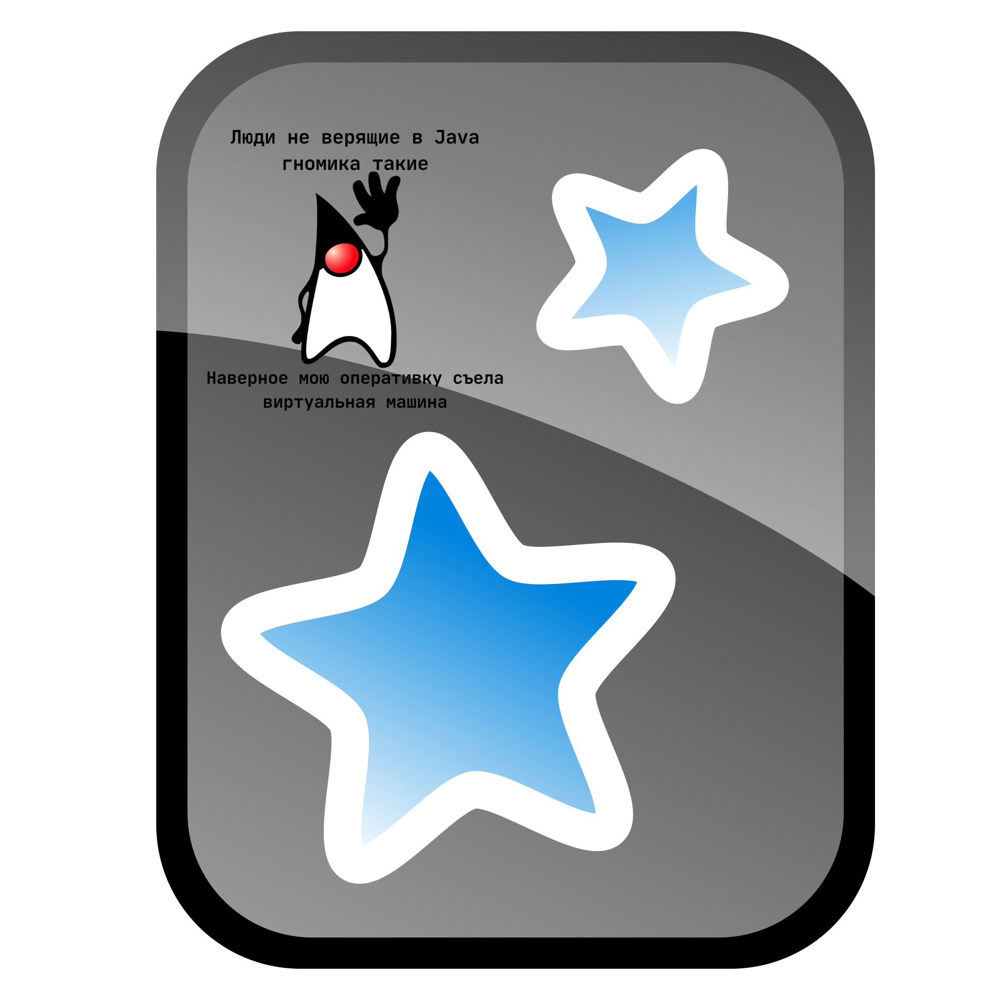

# Anki-колоды для подготовки к Java-собеседованиям (WIP)

  
   

## Почему Anki?

Anki — это приложение, которое помогает учить и запоминать информацию надолго. Показывает вам карточки с вопросами тогда, когда вы начинаете их забывать. В основе лежит метод spaced repetition (интервальное повторение) — когда вы повторяете материал через увеличивающиеся промежутки времени, он лучше закрепляется в памяти ([подробнее о методе тут](https://ru.wikipedia.org/wiki/Интервальные_повторения))

## Почему JavaAnki?
- Все важные вопросы с Java собеседований в одном месте, чтобы избавиться от огромного количества методичек
- Вопросы собраны с реальных собеседований и постоянно обновляются
- Anki помогает запоминать надолго:
  - Сам подбирает, когда повторять карточки
  - Показывает сложные темы чаще, лёгкие — реже
  - Экономит время: учите только то, что начинаете забывать

## Что внутри?

**Колоды с Java-вопросами** по темам:

Java Core 1

- Основы ООП: инкапсуляция, наследование, полиморфизм, абстракция
- Принципы SOLID
- JVM под капотом: JDK, JRE, GC, ClassLoader, JIT
- Работа со строками: String Pool, StringBuilder
- Классы и модификаторы: конструкторы, интерфейсы, enum
- Обработка исключений и try-with-resources
- Сериализация объектов

Java Core 2

- Дженерики и wildcards
- Коллекции: List, Set, Map, Queue
- Функциональные интерфейсы и лямбды
- Stream API и параллельные стримы
- Фишки Java 8+ (вплоть до Java 18): Optional, LocalDateTime, новые методы коллекций

Multithreading

- Основы потоков: Thread vs Runnable
- Синхронизация: synchronized, locks
- Жизненный цикл потоков и их состояния
- Межпоточное взаимодействие: wait/notify
- Атомарность: volatile vs Atomic
- Thread Pools и ForkJoin framework
- Проблемы многопоточности: deadlock, race condition
- Утилиты: java.util.concurrent
- Java Memory Model (JMM)
- Параллельные стримы

SQL & Базы данных

- Основы SQL: DDL, DML, TCL, DCL
- JOIN-ы и их виды
- Агрегатные функции и группировки
- Индексы и оптимизация запросов
- Транзакции и уровни изоляции
- Нормализация и проектирование БД
- Триггеры и хранимые процедуры
- CAP теорема

Hibernate & JPA

- Основы ORM и EntityManager
- Сущности и их жизненный цикл
- Типы связей между сущностями
- Стратегии маппинга и наследования
- Кэширование первого и второго уровня
- JPQL и Criteria API
- N+1 Select и оптимизация запросов
- Работа с транзакциями
- Конфигурация и настройка

Spring Framework

- Spring Core:
  - IoC и DI
  - Бины и их жизненный цикл
  - Конфигурация (XML, Java, Annotations)
- Spring Boot
- Spring Data
- Spring Security
- Spring MVC

Паттерны проектирования

- Порождающие паттерны:
  - Singleton, Factory, Builder
  - Prototype, Abstract Factory
- Структурные паттерны:
  - Adapter, Decorator, Proxy
  - Facade, Composite, Bridge
- Поведенческие паттерны:
  - Observer, Strategy, Command
  - Iterator, Template Method
  - Chain of Responsibility
- GRASP и принципы проектирования

Алгоритмы и структуры данных

- Оценка сложности (Big O)
- Сортировки: быстрая, пузырьковая, слиянием
- Поиск: линейный и бинарный
- Структуры данных:
  - ArrayList vs LinkedList
  - Stack и Queue
  - Binary Tree, Red-Black Tree
- Рекурсия vs Итерация
- Жадные алгоритмы

Доп. темы

- Kubernetes
- Redis
- Docker
- Kafka
- Микросервисы

## Как скачать?

1. Установите [Anki](https://apps.ankiweb.net/) (доступно для Windows, Mac, Linux, Android, iOS).
2. Скачайте `.apkg` файлы из [Releases](https://github.com/Artokrr/JavaAnki/releases).
3. Импортируйте в Anki: **File → Import → Выберите файл**.
4. `profit`

## Кому это полезно?

- Junior → Middle → Senior разработчикам, готовящимся к Java-собеседованиям.
- Всем, кто хочет лучше понимать Java-экосистему.

## Как внести вклад?

Вы можете помочь улучшить проект:
- Открыть Issue с предложением новых вопросов/тем
- Сообщить о неточностях в существующих карточках
- Поделиться идеями по улучшению колод

Для этого:
1. Перейдите в раздел [Issues](https://github.com/Artokrr/JavaAnki/issues)
2. Нажмите "New Issue"
3. Опишите ваше предложение или найденную ошибку
4. Не забудьте указать тему/колоду, к которой относится ваше предложение

Мы рассмотрим все предложения и внесём изменения в следующий релиз колод
